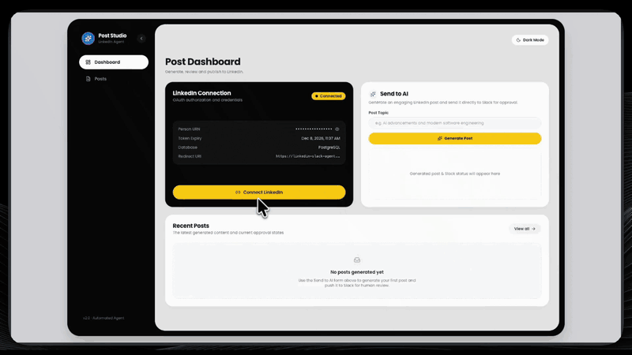
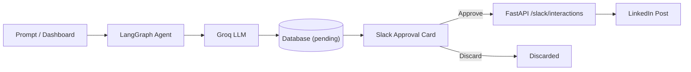

# LinkedIn Post Automation Agent

[](https://render.com/deploy?repo=https://github.com/UzairAtiq/mcp-langraph-agent)

An automated, human-in-the-loop pipeline that generates technical LinkedIn posts using Groq LLMs, delivers interactive approval cards to Slack, and publishes approved posts to LinkedIn.

**Tech Stack:** LangGraph · MCP · FastAPI · React · Groq

<p align="center"></p>

## Features

* **AI Post Generation** — Drafts technical, engaging LinkedIn posts with Groq LLMs and LangGraph workflows.
* **Human-in-the-Loop Slack Approvals** — Interactive Slack Block Kit cards with 1-click Approve and Discard actions.
* **Automated Publishing** — Publishes approved posts to LinkedIn API with automated OAuth 2.0 token refreshes.
* **Web Dashboard** — React 18 + Vite interface to generate posts, review queue status, and manage connections.

## Architecture



## Quickstart

```bash
# 1. Clone repository & install dependencies
git clone https://github.com/UzairAtiq/mcp-langraph-agent.git
cd mcp-langraph-agent
python3 -m venv .venv
source .venv/bin/activate
pip install -r project/backend/requirements.txt

# 2. Configure environment variables
cp .env.example .env
```

Fill in the 4 required keys in `.env`:
* `GROQ_API_KEY`
* `SLACK_WEBHOOK_URL`
* `LINKEDIN_CLIENT_ID`
* `LINKEDIN_CLIENT_SECRET`

```bash
# 3. Build frontend & run backend
cd project/frontend && npm install && npm run build
cd ../backend && uvicorn main:app --reload --port 8000
```

Open [http://localhost:8000](http://localhost:8000) to view the dashboard and connect your LinkedIn account.

## Documentation

* [Development & Testing](docs/development.md) — Running the LangGraph agent CLI, unit tests, and evaluations.
* [LinkedIn App & OAuth Setup](docs/linkedin_setup.md) — Developer app creation, permissions, and 60-day token lifecycle.
* [Slack App & Interactivity Setup](docs/slack_setup.md) — Webhooks, Block Kit approval cards, and interaction callbacks.
* [Render Cloud Deployment](docs/deployment.md) — 1-click Blueprint deployment and PostgreSQL setup.
* [Project Structure & Architecture](docs/PROJECT_STRUCTURE.md) — Full codebase directory breakdown and file map.

## Repository Structure

<details>
<summary>Repository structure</summary>

```
mcp-langraph-agent/
├── README.md               # Main project documentation and quickstart
├── render.yaml             # Render Blueprint infrastructure configuration
├── .gitignore              # Git ignore rules
├── assets/                 # Media and demo assets
├── project/
│   ├── backend/            # FastAPI, LangGraph agent, MCP servers, data, and tests
│   │   ├── agent/          # State graph, workflow nodes, and tool adapters
│   │   ├── api/            # API entrypoints
│   │   ├── config/         # App constants and settings
│   │   ├── data/           # SQLite / PostgreSQL persistence and token store
│   │   ├── mcp_servers/    # Stdio MCP servers (db, slack, post_generator)
│   │   ├── observability/  # Langfuse tracing
│   │   ├── services/       # Integrations for Groq, LinkedIn, and Slack
│   │   ├── tests/          # Test suite
│   │   ├── main.py         # Unified FastAPI application
│   │   └── requirements.txt# Backend dependencies
│   └── frontend/           # React 18 + Vite + Tailwind dashboard
├── docs/                   # Setup guides and architecture documentation
└── _notes/                 # Plans, prompts, and knowledge graph analysis
```

</details>
