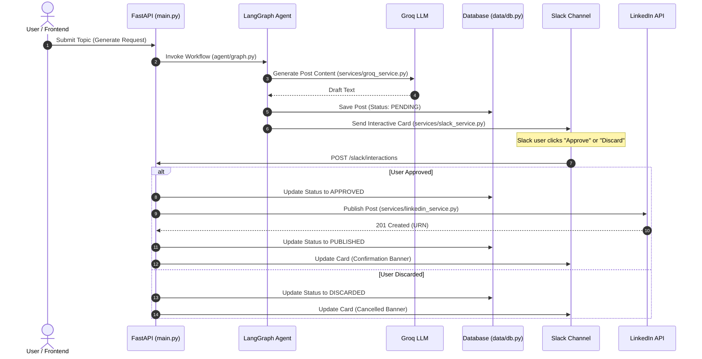

# Project Structure & Repository Reference

## Overview
This repository implements an automated, human-in-the-loop LinkedIn post creation and publishing pipeline. It combines:
- **Groq LLM**: Automated generation of technical and engaging LinkedIn posts.
- **LangGraph**: Agent workflow orchestration with modular state management and node transitions.
- **Model Context Protocol (MCP)**: Tool and context server endpoints (`db_server`, `slack_server`, `linkedin_post_generator`).
- **Slack Block Kit**: Interactive human review cards with interactive *Approve* and *Discard* actions.
- **FastAPI**: Backend REST API handling OAuth 2.0 handshakes, interactive Slack webhooks, and frontend endpoints.
- **React + Vite Dashboard**: Modern frontend UI for managing connections, generating posts, and reviewing histories.
- **PostgreSQL / SQLite**: Dual-mode persistence for token lifecycle management and post history.
- **Langfuse**: Observability and trace tracking for LLM executions.

---

## Directory Tree

```
mcp-langraph-agent/
├── README.md               # Main project documentation and quickstart
├── render.yaml             # Render Blueprint infrastructure-as-code configuration
├── .gitignore              # Git ignore rules
├── project/
│   ├── backend/            # Python backend service
│   │   ├── agent/          # LangGraph agent definitions, graph orchestration, nodes, tools
│   │   ├── api/            # API compatibility wrappers and entry points
│   │   ├── config/         # Centralized configuration and constants
│   │   ├── data/           # Database models, token storage, and post storage
│   │   ├── mcp_servers/    # Model Context Protocol (MCP) server implementations
│   │   ├── observability/  # Langfuse tracing and monitoring setup
│   │   ├── services/       # External service integrations (Groq, LinkedIn, Slack)
│   │   ├── tests/          # Unit and integration test suite
│   │   ├── conftest.py     # Pytest configuration and sys.path setup
│   │   ├── main.py         # Core FastAPI application and primary server entry point
│   │   ├── Procfile        # Web process start command for cloud deployments
│   │   └── requirements.txt# Python dependency manifest
│   └── frontend/           # React + TypeScript + Vite + Tailwind dashboard
│       ├── src/            # Components, pages, context, and client API
│       ├── index.html      # Main dashboard HTML entry
│       ├── callback.html   # OAuth redirect handler template
│       ├── error.html      # OAuth failure template
│       ├── package.json    # Frontend dependencies and npm scripts
│       ├── tailwind.config.js # Tailwind CSS design configuration
│       └── vite.config.ts  # Vite build configuration and proxy setup
├── evals/                  # Benchmark evaluations (LLM-as-a-judge, test cases)
│   ├── dataset.json        # Evaluation benchmark scenarios and results
│   ├── dataset.py          # Benchmark test dataset definitions
│   ├── judge.py            # LLM-as-a-judge scoring model
│   └── run_evals.py        # Benchmark execution runner
├── docs/                   # System and setup documentation
│   ├── PROJECT_STRUCTURE.md# Repository architecture and directory map
│   ├── linkedin_setup.md   # LinkedIn developer app and OAuth setup
│   ├── slack_setup.md      # Slack app, webhook, and interactive cards setup
│   └── deployment.md       # Render cloud deployment and environment guide
└── _notes/                 # Development plans, prompts, and analysis
    ├── plans/              # Architecture and implementation plans
    ├── prompts/            # Agent and LLM prompt iterations
    └── graphify-out/       # Code knowledge graph outputs and reports
```

---

## Core Modules & Directory Breakdown

### 1. `project/backend/`
Contains the complete Python application, LangGraph workflow, MCP tool servers, and FastAPI REST endpoints.

| Directory / File | Description |
| :--- | :--- |
| `main.py` | **Primary FastAPI Entry Point**: Serves REST APIs (`/health`, `/posts`, `/generate`), handles OAuth callbacks (`/auth/linkedin`, `/linkedin/callback`), receives interactive Slack button payloads (`/slack/interactions`), mounts frontend static assets, and manages background token refreshes. |
| `agent/` | **LangGraph Orchestration**: State graph compiler (`graph.py`), graph nodes (`nodes.py`), typed agent state dictionary (`state.py`), and MCP client tool bindings (`tools.py`). |
| `api/` | **Compatibility Layer**: Imports `app` from `main.py` for uvicorn entry compatibility. |
| `config/` | **Application Config**: Environment settings, base directory resolution, and constants (`constants.py`, `settings.py`). |
| `data/` | **Persistence Layer**: Multi-tier storage supporting PostgreSQL and local SQLite (`db.py`), post lifecycle tracking (`post_storage.py`), and OAuth token lifecycle management (`token_storage.py`). |
| `mcp_servers/` | **Model Context Protocol Servers**: Stdio tool servers for database queries (`db_server.py`), post generation (`linkedin_post_generator.py`), and Slack message dispatching (`slack_server.py`). |
| `observability/` | **Telemetry**: Langfuse tracing integration and callback handler setup (`tracing.py`). |
| `services/` | **External Services**: Client wrappers for Groq LLM (`groq_service.py`), LinkedIn REST API (`linkedin_service.py`), and Slack Block Kit (`slack_service.py`). |
| `tests/` | **Automated Tests**: Unit and integration test suites (`test_agent.py`, `test_mcp_servers.py`, `test_linkedin_post_flow.py`, `test_slack.py`, `linkedin_token.py`). |
| `Procfile` | **Cloud Process Config**: Declares the web process command (`uvicorn main:app --host 0.0.0.0 --port $PORT`). |
| `requirements.txt` | **Dependencies**: Packages required to run the backend service. |

---

### 2. `project/frontend/`
Modern client dashboard built with React 18, Vite, TypeScript, and Tailwind CSS.
- **`src/pages/`**: `Dashboard.tsx` for real-time status and post triggering; `Posts.tsx` for post history.
- **`src/components/`**: Modular UI components (`ConnectionCard.tsx`, `GenerateCard.tsx`, `PostsCard.tsx`, `Sidebar.tsx`, `StatusBadge.tsx`, `ThemeToggle.tsx`).
- **`src/api.ts`**: Typed client methods communicating with backend endpoints.
- **`dist/`**: Compiled production bundle served directly by FastAPI.

---

### 3. `evals/`
Standalone evaluation benchmark suite maintained at the repository root.
- **`dataset.json`**: Evaluation test inputs, expected tool calls, and evaluation results.
- **`dataset.py`**: Evaluation test cases across scenarios (full flow, lookup only, slack only).
- **`judge.py`**: LLM-as-a-judge prompt evaluation that grades agent tool calls against expected behaviors.
- **`run_evals.py`**: Automated runner executing test cases and reporting scores.

---

### 4. `docs/`
Dedicated project documentation:
- **[`PROJECT_STRUCTURE.md`](file:///Users/uzair/Developer/mcp-langraph-agent/docs/PROJECT_STRUCTURE.md)**: Repository layout and architectural guide.
- **[`linkedin_setup.md`](file:///Users/uzair/Developer/mcp-langraph-agent/docs/linkedin_setup.md)**: LinkedIn Developer app registration, OAuth permissions, and token refresh guide.
- **[`slack_setup.md`](file:///Users/uzair/Developer/mcp-langraph-agent/docs/slack_setup.md)**: Slack App creation, webhook creation, interactive buttons, and ngrok tunneling.
- **[`deployment.md`](file:///Users/uzair/Developer/mcp-langraph-agent/docs/deployment.md)**: 1-click Render blueprint deployment, PostgreSQL database linking, and environment variables.

---

### 5. `_notes/`
Internal staging and planning directory:
- **`plans/`**: Architectural plans, migrations, and technical tasks.
- **`prompts/`**: LLM system prompts, iterations, and evaluation prompt templates.
- **`graphify-out/`**: Code knowledge graphs and dependency analysis maps.

---

## Architectural Sequence Diagram


